# 🔁 Research System Pipeline & Data Flow Architecture

> **Complete Data Handoff Guide for the 7-Phase Startup Research System**

This system transforms disconnected prompt files into an integrated, end-to-end data pipeline. Every phase produces a structured, standardized output block (`<!-- BEGIN P{n}_HANDOFF -->`) that seamlessly attaches to the input of the next phase.

---

## 🗺️ Pipeline Architecture (Mermaid)

```mermaid
flowchart TD
    subgraph Inputs
        A[User Problem Hypothesis] --> P1
        ICP[Target Audience / ICP] --> P1
    end

    subgraph P1 [Phase 1: Validate]
        P1_Run[Live Web Search: Reddit, Reviews, G2]
        P1_Eval[Evaluate: Frequency, Severity, WTP]
        P1_Verdict{Verdict?}
        P1_Handoff[P1_HANDOFF Block]
        P1_Run --> P1_Eval --> P1_Verdict
        P1_Verdict -->|GO / MAYBE| P1_Handoff
        P1_Verdict -->|NO-GO| Stop[Pivot or Rephrase Problem]
    end

    subgraph P2 [Phase 2: Top 10 Solutions]
        P2_Input[Inject P1_HANDOFF]
        P2_Search[Audit: Direct, Indirect, Workarounds]
        P2_Handoff[P2_HANDOFF Block + Competitors Roster]
        P2_Input --> P2_Search --> P2_Handoff
    end

    subgraph P3 [Phase 3: Research x10]
        P3_Input[Inject Competitor List from P2]
        P3_Audit[10 Deep Profiles: Love, Hate, Workarounds]
        P3_Profiles[P3_PROFILE Blocks with THIS TOOL DOES NOT]
        P3_Input --> P3_Audit --> P3_Profiles
    end

    subgraph P4 [Phase 4: Gap Analysis]
        P4_Input[Inject P1 Problem + All 10 P3 Profiles]
        P4_Matrix[Feature Matrix: Check / Tilde / Cross]
        P4_Score[Opportunity Score Formula]
        P4_Handoff[P4_HANDOFF: Top 5 Gaps & #1 Gap]
        P4_Input --> P4_Matrix --> P4_Score --> P4_Handoff
    end

    subgraph P5 [Phase 5: Verify Gaps]
        P5_Input[Inject Top 5 Gaps from P4]
        P5_Search[9-Platform Forensic Search]
        P5_Filter[Filter out False Gaps]
        P5_Handoff[P5_HANDOFF: Confirmed Opportunities & MVP]
        P5_Input --> P5_Search --> P5_Filter --> P5_Handoff
    end

    subgraph P6 [Phase 6: Final Diligence Memo]
        P6_Input[Inject P1 + P2 + P3 + P4 + P5 Handoffs]
        P6_Audit[Claim Audit & Fact Check]
        P6_Memo[Investor-Ready Opportunity Memo]
        P6_Handoff[P6_HANDOFF: Launch Spec & 30-Day Plan]
        P6_Input --> P6_Audit --> P6_Memo --> P6_Handoff
    end

    subgraph P7 [Phase 7: Launch README & Pitch]
        P7_Input[Inject P6_HANDOFF]
        P7_Gen[Generate Production GitHub README]
        P7_Output[Hero Header, Comp Matrix, Quickstart, Pitch]
        P7_Input --> P7_Gen --> P7_Output
    end

    P1_Handoff --> P2_Input
    P2_Handoff --> P3_Input
    P3_Profiles --> P4_Input
    P4_Handoff --> P5_Input
    P5_Handoff --> P6_Input
    P6_Handoff --> P7_Input
```



---

## 📋 Data Handoff Specifications

### 1. Phase 1 → Phase 2 (`P1_HANDOFF`)
* **Produced by:** [`P1_Validate.md`](./P1_Validate.md)
* **Consumed by:** [`P2_Top10.md`](./P2_Top10.md)
* **Format:**
```markdown
<!-- BEGIN P1_HANDOFF -->
PROBLEM_STATEMENT: Freelancers lose revenue in client revision loops without automated scope enforcement.
TARGET_AUDIENCE: Freelance web designers and boutique creative agencies.
FREQUENCY: Daily — revision friction occurs on ~80% of active projects.
SEVERITY: 8/10 — direct revenue leakage of $500–$2,000/mo.
WILLINGNESS_TO_PAY: Yes — users pay $15–$45/mo for partial invoicing/portal tools.
KEY_SOURCES: [Reddit links, G2 reviews]
VERDICT: GO ✅
KEY_PAIN_SIGNALS: [Endless minor tweak requests, awkward payment demands, milestone disputes]
<!-- END P1_HANDOFF -->
```

### 2. Phase 2 → Phase 3 (`P2_HANDOFF`)
* **Produced by:** [`P2_Top10.md`](./P2_Top10.md)
* **Consumed by:** [`P3_Research_x10.md`](./P3_Research_x10.md)
* **Format:**
```markdown
<!-- BEGIN P2_HANDOFF -->
PROBLEM_SPACE: Freelance Deliverable Scope Enforcement & Revision Paywall
TARGET_AUDIENCE: Freelance designers and agencies

TOP_10_TABLE:
| # | Name | URL | Type | Pricing | Target User | 3 Key Features | Limitation |
| 1 | Bonsai | https://hellobonsai.com | Direct | $25/mo | Freelancers | Invoicing, Contracts | No revision gating |
...

COMPETITORS_FOR_P3:
1. Name: Bonsai | URL: https://hellobonsai.com | Type: Direct | Focus: All-in-one freelance management
2. Name: HoneyBook | URL: https://honeybook.com | Type: Direct | Focus: Client communication and billing
...
<!-- END P2_HANDOFF -->
```

### 3. Phase 3 → Phase 4 (`P3_PROFILE`s)
* **Produced by:** [`P3_Research_x10.md`](./P3_Research_x10.md)
* **Consumed by:** [`P4_Gap_Analysis.md`](./P4_Gap_Analysis.md)
* **Format:**
```markdown
<!-- BEGIN P3_PROFILE: Bonsai -->
COMPETITOR_NAME: Bonsai
WEBSITE: https://hellobonsai.com
TYPE: Direct
1. PRODUCT PROFILE: Invoicing and contract suite.
2. COMPANY INTEL: 500k users.
3. PRICING TIERS: $25–$79/mo.
4. WHAT USERS LOVE: Clean invoices.
5. WHAT USERS HATE: Clunky mobile app, price hikes.
6. CRITICAL GAPS: Contracts describe revisions in text, but never gate revision requests.
THIS TOOL DOES NOT: count client revision rounds, enforce contract caps, or trigger one-click paid change orders.
<!-- END P3_PROFILE: Bonsai -->
```

### 4. Phase 4 → Phase 5 (`P4_HANDOFF`)
* **Produced by:** [`P4_Gap_Analysis.md`](./P4_Gap_Analysis.md)
* **Consumed by:** [`P5_Verify_Gaps.md`](./P5_Verify_Gaps.md)
* **Format:**
```markdown
<!-- BEGIN P4_HANDOFF -->
TOP_5_GAPS:
GAP 1: Automated Revision Gating (Smart Scope Paywall) — Deliverable portal that caps rounds and requires Stripe payment for extras.
GAP 2: Proofing-to-Billing Bridge — Connects visual markup directly to invoice change orders.
GAP 3: Passwordless Client Approval Link — Zero-friction client portal.
GAP 4: Crowdsourced Scope Benchmarking.
GAP 5: Independent Contract Revision Escrow.

#1_RECOMMENDED_GAP:
NAME: Automated Revision Gating (Smart Scope Paywall)
CATEGORY: Workflow & Pricing Gap
OPPORTUNITY_SCORE: 8.5/10
KEY_DIFFERENTIATOR: Software-enforced bad-cop that stops unpaid revision scope creep.
<!-- END P4_HANDOFF -->
```

### 5. Phase 5 → Phase 6 (`P5_HANDOFF`)
* **Produced by:** [`P5_Verify_Gaps.md`](./P5_Verify_Gaps.md)
* **Consumed by:** [`P6_Final_Report.md`](./P6_Final_Report.md)
* **Format:**
```markdown
<!-- BEGIN P5_HANDOFF -->
VERIFIED_GAPS:
- GAP 1: Automated Revision Gating | VERDICT: CONFIRMED ✅
  EVIDENCE: No existing feedback tools enforce paid revision rounds.
  WHY_UNBUILT: Enterprise tools focus on unlimited feedback.
  WHY_NOW: Solo indie creators demand automated payment enforcement.
  MINIMAL_MVP_FEATURES: [Deliverable link, revision counter, Stripe paywall, 7-day auto-accept timer]

RECOMMENDED_WEDGE:
PRIMARY_OPPORTUNITY: Automated Revision Gating (Smart Scope Paywall)
CORE_VALUE_PROP: "The polite bad-cop for your client projects. Never do an unpaid revision round again."
MVP_BUILD_SCOPE: Deliverable link + revision counter + Stripe checkout.
<!-- END P5_HANDOFF -->
```

### 6. Phase 6 → Phase 7 (`P6_HANDOFF`)
* **Produced by:** [`P6_Final_Report.md`](./P6_Final_Report.md)
* **Consumed by:** [`P7_Make_README.md`](./P7_Make_README.md)
* **Format:**
```markdown
<!-- BEGIN P6_HANDOFF -->
PROJECT_NAME_PROPOSAL: ScopeLock
ONE_LINE_PITCH: The automated client revision gatekeeper that stops scope creep and turns extra feedback rounds into paid change orders.
PROBLEM_STATEMENT: Freelancers lose $1,200/mo and 15 hours in unpaid client revision loops.
TARGET_AUDIENCE_ICP: Solo Webflow/Framer/Figma designers charging $1,500–$10,000 per project.
CORE_DIFFERENTIATOR (THE VERIFIED GAP): Live deliverable portal with an automated revision counter that bills extra rounds via Stripe before feedback reaches the designer.
MVP_CORE_FEATURES: [Magic links, revision counter, Stripe change-order paywall, 7-day auto-approval timer]
TECH_STACK_SUGGESTION: Next.js / TailwindCSS / Supabase / Stripe / Vercel
30_DAY_LAUNCH_PLAN: [Landing page, MVP build, 10 beta freelancers, public launch]
<!-- END P6_HANDOFF -->
```

---

## 🛠️ Execution Methods

### Method 1: Interactive Browser UI (Zero Setup)
Open [`startup_research_playbook.html`](./startup_research_playbook.html) in your browser.
1. Enter your problem and ICP.
2. Click **Generate Phase Prompt** and copy the prompt.
3. Paste AI output into the response box.
4. The web application **automatically parses the handoff block and attaches it to the next phase**.
5. Click **⚡ Load Sample Project** to preview an entire pre-computed pipeline.

### Method 2: Python CLI Runner (`research_pipeline.py`)
Run straight from your terminal:
```bash
# 1. Initialize research
python research_pipeline.py init "Your 2-line problem statement" --audience "Target ICP"

# 2. Get prompt for any phase (previous phase data auto-attached!)
python research_pipeline.py prompt 1
python research_pipeline.py prompt 2

# 3. Save AI response (automatically extracts handoff)
python research_pipeline.py save 1 --file p1_response.txt

# 4. Check status across all 7 phases
python research_pipeline.py status

# 5. Compile into a single master dossier
python research_pipeline.py compile

# 6. Launch local web UI
python research_pipeline.py serve
```

### Method 3: Manual Claude.ai Chaining
If copying prompts directly into Claude:
1. Run `P1_Validate.md`. Copy the `<!-- BEGIN P1_HANDOFF -->` block.
2. Paste it into `P2_Top10.md`. Copy the `<!-- BEGIN P2_HANDOFF -->` block.
3. Paste into `P3_Research_x10.md`. Collect all `P3_PROFILE` blocks.
4. Paste P1 + P3 blocks into `P4_Gap_Analysis.md`. Copy `<!-- BEGIN P4_HANDOFF -->`.
5. Paste into `P5_Verify_Gaps.md`. Copy `<!-- BEGIN P5_HANDOFF -->`.
6. Paste all blocks into `P6_Final_Report.md`. Copy `<!-- BEGIN P6_HANDOFF -->`.
7. Paste into `P7_Make_README.md` to get your finished project README!
