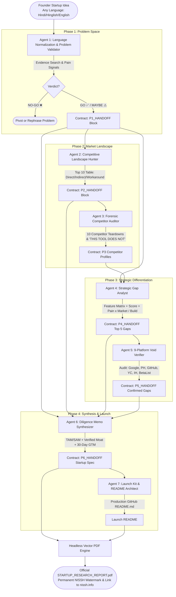
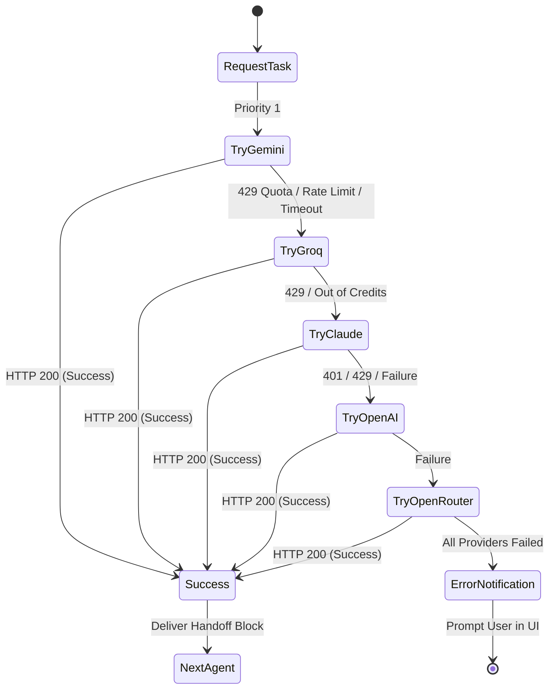

# 🚀 Nissh Research System: 7-Agent Autonomous Startup Intelligence

<div align="center">

**From Multilingual Problem Hypothesis to Investor-Grade Watermarked PDF Diligence — Powered by 7 Sequential Autonomous AI Agents with Auto-Fallback.**

[-6366f1?style=for-the-badge&logo=safari&logoColor=white)](https://nissh.info)
[](https://nissh.info)
[](LICENSE)
[](https://python.org)
[](https://github.com/Niss54/research-system)

> *"Never build a startup on assumptions. Validate customer pain with real evidence, uncover competitor blindspots, verify voids across 9 platforms, and compile honest, investor-grade research."*

[🌐 Explore Creator Portfolio (nissh.info)](https://nissh.info) · [📐 View Architecture](#-system-architecture) · [🚀 Quickstart](#-how-to-use-this-repository) · [🤖 The 7 Agents](#-the-7-autonomous-agents)

</div>

---

## 📑 Table of Contents
1. [🌟 Why This Research System Exists](#-why-this-research-system-exists)
2. [📐 System Architecture](#-system-architecture)
   - [Multi-Agent Execution Flowchart](#1-multi-agent-execution-flowchart)
   - [Multi-Provider Auto-Fallback State Machine](#2-multi-provider-auto-fallback-state-machine)
   - [Full System Architecture Diagram](#3-full-system-architecture-diagram)
3. [🤖 The 7 Autonomous Agents](#-the-7-autonomous-agents)
4. [🚀 How to Use This Repository (3 Execution Modes)](#-how-to-use-this-repository)
   - [Mode 1: Autonomous Web UI (Recommended)](#mode-1-autonomous-web-ui-recommended)
   - [Mode 2: No-Code Manual Prompt Chaining (Claude / ChatGPT / Gemini)](#mode-2-no-code-manual-prompt-chaining-claude--chatgpt)
   - [Mode 3: Terminal CLI Runner](#mode-3-terminal-cli-runner)
5. [🔑 Multi-Provider API Key Setup & Fallback Rules](#-multi-provider-api-key-setup--fallback-rules)
6. [📄 Permanent Watermark & Clickable Portfolio PDF](#-permanent-watermark--clickable-portfolio-pdf)
7. [📁 Repository Structure](#-repository-structure)
8. [👨‍💻 Creator & Acknowledgements](#-creator--acknowledgements)

---

## 🌟 Why This Research System Exists

Most startup ideas fail not because of poor coding, but because **founders build solutions to problems nobody actually cares about**. Traditional research is either biased (founders asking friends who lie to be polite) or superficial (generic ChatGPT prompts generating flattering hallucinations).

The **Nissh Research System** solves this with an unyielding, evidence-first framework:
- **Zero Flattery / Strict Veracity:** If an idea lacks evidence or daily severity, the system delivers an uncompromising **NO-GO ❌** verdict with cited sources.
- **Multilingual Input Normalization:** Founders can type in their native tongue (Hindi, Hinglish, Spanish, French, etc.). The system normalizes the hypothesis into professional English for rigorous research.
- **Fail-Safe Autonomous Chaining:** Set your preferred LLM keys. If one provider runs out of credits or encounters a rate limit at Agent 4, the **Auto-Fallback Engine** silently shifts to your backup provider without aborting the research run.
- **Permanent NISSH Watermarking:** The resulting multi-page dossier features embedded vector watermark layers and live hyperlinks navigating to [nissh.info](https://nissh.info).

---

## 📐 System Architecture

### 1. Multi-Agent Execution Flowchart



---

### 2. Multi-Provider Auto-Fallback State Machine



---

### 3. Full System Architecture Diagram

```text
┌────────────────────────────────────────────────────────────────────────────────────────┐
│                               FRONTEND PRESENTATION LAYER                              │
│  - Animated Glassmorphic Interface (nissh.info Design Theme)                           │
│  - Multilingual Single Input Box (Hindi / Hinglish / English / Any)                    │
│  - Real-time Terminal Log Stream & 7-Agent Visual Status Cards                         │
│  - API Keys Modal with Active Fallback Badges & 1-Click PDF Download                   │
└────────────────────────────────────────┬───────────────────────────────────────────────┘
                                         │ REST API / WebSocket Polling
┌────────────────────────────────────────▼───────────────────────────────────────────────┐
│                              FLASK LOCAL SERVER (server.py)                            │
│  - /api/run          : Spawns Background Research Orchestration Thread                 │
│  - /api/status       : Returns Live Agent Status, Terminal Logs & Fallback Events      │
│  - /api/keys         : Encrypted / Masked Key Health Monitor                           │
│  - /api/save-keys    : Persists User Keys to .env                                      │
│  - /api/download-pdf : Streams Official PDF Report with Nissh Watermark                │
└────────────────────────────────────────┬───────────────────────────────────────────────┘
                                         │ Python Subprocess / Threading
┌────────────────────────────────────────▼───────────────────────────────────────────────┐
│                    AUTONOMOUS RESEARCH ORCHESTRATOR (research_engine.py)               │
│                                                                                        │
│   MultiProviderLLM Fallback Engine:                                                    │
│   [Gemini Flash] ──► [Groq Llama 3.3] ──► [Claude 3.5] ──► [GPT-4o] ──► [OpenRouter]   │
│                                                                                        │
│   Sequential Execution:                                                                │
│   Agent 1 (Validate) ──► Agent 2 (Top 10) ──► Agent 3 (Forensics) ──►                 │
│   Agent 4 (Gap Matrix) ──► Agent 5 (9-Platform Verification) ──►                      │
│   Agent 6 (Diligence Memo) ──► Agent 7 (Launch README)                                 │
└────────────────────────────────────────┬───────────────────────────────────────────────┘
                                         │ Render HTML & Vector Stream
┌────────────────────────────────────────▼───────────────────────────────────────────────┐
│                    HEADLESS VECTOR PDF COMPILER (pdf_generator.py)                     │
│  - Chrome / Edge Headless Print Engine (--headless=new --print-to-pdf)                 │
│  - Permanent Diagonal Vector Watermark Layers ("NISSH • NISSH.INFO")                   │
│  - Active Embedded Clickable Hyperlinks to https://nissh.info                          │
│  - Output File: workspace/STARTUP_RESEARCH_REPORT.pdf                                  │
└────────────────────────────────────────────────────────────────────────────────────────┘
```

---

## 🤖 The 7 Autonomous Agents

Every agent executes with a strict, specialized charter to eliminate biases and surface unvarnished reality:

```text
1. Problem Validator ──► 2. Landscape Hunter ──► 3. Forensic Auditor ──► 4. Gap Strategist
                                                                               │
[Watermarked PDF Report] ◄── 7. Launch README ◄── 6. Diligence Memo ◄── 5. Void Verifier
```

| Agent # | Name | Primary Charter | Evidence Checkpoints | Handoff Contract |
|:---:|---|---|---|---|
| **1** | **Problem Validator** | Normalizes input language to English; determines if the problem is a painful reality or founder fantasy. | • Reddit complaint volume<br/>• Severity (1–10: financial loss / wasted time)<br/>• Willingness to Pay for workarounds | `<!-- BEGIN P1_HANDOFF -->`<br/>Verdict: GO ✅ / MAYBE ⚠️ / NO-GO ❌ |
| **2** | **Landscape Hunter** | Discovers existing products, niche SaaS, and DIY workarounds. | • Product Hunt, G2, Capterra<br/>• Spreadsheets & Notion templates<br/>• Direct vs Indirect vs Manual solutions | `<!-- BEGIN P2_HANDOFF -->`<br/>Top 10 Competitive Landscape Table |
| **3** | **Forensic Auditor** | Conducts 360-degree teardowns of competitors to locate where they break. | • Low-star user reviews (1-2★)<br/>• Recurring Reddit frustration posts<br/>• "THIS TOOL DOES NOT:" statements | `<!-- BEGIN P3_PROFILE: [TOOL] -->`<br/>10 Competitor Teardowns |
| **4** | **Gap Strategist** | Builds an exhaustive cross-competitor feature matrix and scores voids. | • Matrix: Features vs 10 Competitors<br/>• Score: `(Pain × Market) / Difficulty`<br/>• Top 5 ranked market opportunities | `<!-- BEGIN P4_HANDOFF -->`<br/>Top 5 Scored Gaps & #1 Wedge |
| **5** | **Void Verifier** | Forensically searches 9 platforms to eliminate false leads. | • Audits Google, PH, GitHub, YC, IndieHackers, BetaList, TechCrunch, LinkedIn, Reddit<br/>• Labels Confirmed vs False Gaps | `<!-- BEGIN P5_HANDOFF -->`<br/>Confirmed vs Partial vs False Gaps |
| **6** | **Diligence Synthesizer** | Assembles an investor-ready diligence memo, separating facts from estimates. | • ICP profile & current cost of inaction<br/>• TAM/SAM reality check<br/>• Defensible moat & 30-day GTM roadmap | `<!-- BEGIN P6_HANDOFF -->`<br/>Startup Opportunity Memo |
| **7** | **Launch Kit Architect** | Generates the official production GitHub `README.md` and positioning kit. | • Hero badges, ASCII logo, value prop<br/>• Problem & Gap breakdown<br/>• Developer quickstart & 30-day plan | Production `README.md` File |

---

## 🚀 How to Use This Repository

You can run this system in **3 different ways**, depending on your workflow and technical preference.

### Mode 1: Autonomous Web UI (Recommended)

Run the full autonomous system locally with the modern, animated web interface:

#### Step 1: Clone Repository
```bash
git clone https://github.com/Niss54/research-system.git
cd research-system
```

#### Step 2: Install Dependencies
```bash
pip install -r requirements.txt
```

#### Step 3: Configure API Keys
Copy the example file and add at least one API key:
```bash
cp .env.example .env
```
*(You can also input your keys directly inside the UI modal without opening `.env`).*

#### Step 4: Start the Server
```bash
python server.py
```

#### Step 5: Run Your Research
1. Open **`http://localhost:5000`** in your browser.
2. In the main input box, describe your startup idea in **any language** (e.g. Hindi, Hinglish, Spanish, or English):
   > *"Freelance web designers client revision loop mein phas jaate hain aur extra revision ke paise nahi milte..."*
3. *(Optional)* Add a target audience hint (e.g., *"Freelance designers and small creative agencies"*).
4. Click **🚀 Launch 7 Autonomous Agents**.
5. Watch the live terminal console and agent status cards execute sequentially.
6. Once complete, click **📥 Download PDF Report** to save your official watermarked research report!

*(Want an instant preview? Click **⚡ Load Sample Demo (ScopeLock)** in the top navigation to instantly load a complete verified SaaS research project!)*

---

### Mode 2: No-Code Manual Prompt Chaining (Claude / ChatGPT)

If you prefer **not** to run Python or install dependencies locally, you can use the 7 standardized Markdown files with **Claude.ai**, **ChatGPT**, or **Gemini Web**:

```text
[P1_Validate.md] ──► Output Handoff ──► [P2_Top10.md] ──► Output Handoff ──► [P3_Research_x10.md]
                                                                                      │
[P7_Make_README.md] ◄── Output Handoff ◄── [P6_Final_Report.md] ◄── [P5_Verify_Gaps.md] ◄── [P4_Gap_Analysis.md]
```

1. **Phase 1:** Open [`P1_Validate.md`](P1_Validate.md). Copy the prompt into Claude (enable **Web Search** & **Extended Thinking**). Paste your problem hypothesis.
   - *Result:* Claude evaluates the problem and outputs an `<!-- BEGIN P1_HANDOFF -->` block.
2. **Phase 2:** Open [`P2_Top10.md`](P2_Top10.md). Paste your P1 handoff block into the prompt.
   - *Result:* Claude searches for the 10 closest competitors and outputs `<!-- BEGIN P2_HANDOFF -->`.
3. **Phase 3:** Open [`P3_Research_x10.md`](P3_Research_x10.md). Feed in the competitor list from P2.
   - *Result:* Claude produces 10 deep-dive competitor profiles with `THIS TOOL DOES NOT:` lines.
4. **Phase 4:** Open [`P4_Gap_Analysis.md`](P4_Gap_Analysis.md). Paste your P1 block and all 10 P3 profiles.
   - *Result:* Claude constructs a Feature Matrix and outputs `<!-- BEGIN P4_HANDOFF -->` with the Top 5 scored gaps.
5. **Phase 5:** Open [`P5_Verify_Gaps.md`](P5_Verify_Gaps.md). Paste the P4 gaps.
   - *Result:* Claude audits 9 platforms and filters out false gaps, producing `<!-- BEGIN P5_HANDOFF -->`.
6. **Phase 6:** Open [`P6_Final_Report.md`](P6_Final_Report.md). Paste all previous handoff blocks.
   - *Result:* Claude synthesizes an investor diligence memo with TAM, moats, and a 30-day action plan.
7. **Phase 7:** Open [`P7_Make_README.md`](P7_Make_README.md). Paste the P6 output.
   - *Result:* Claude produces a production-ready GitHub `README.md` for your new startup!

---

### Mode 3: Terminal CLI Runner

Power users can execute and stitch phases directly from the command line using `research_pipeline.py`:

```bash
# 1. Initialize a new research dossier
python research_pipeline.py init "Designers losing revenue on unbilled client revisions" --audience "Freelancers"

# 2. Generate the dynamic prompt for Phase 1 (previous handoffs auto-injected)
python research_pipeline.py prompt 1

# 3. Save the AI response (automatically extracts handshake contract)
python research_pipeline.py save 1 --file p1_response.txt

# 4. Generate the prompt for Phase 2
python research_pipeline.py prompt 2
python research_pipeline.py save 2 --file p2_response.txt

# 5. Check pipeline health across all 7 stages
python research_pipeline.py status

# 6. Compile everything into a single Markdown dossier
python research_pipeline.py compile

# 7. Render official vector PDF report
python pdf_generator.py
```

---

## 🔑 Multi-Provider API Key Setup & Fallback Rules

You only need **ONE** API key to get started. Providing multiple keys enables the **Auto-Fallback Engine**, ensuring uninterrupted research even if you hit free-tier rate limits:

```text
Priority 1: Google Gemini (Gemini 1.5 Flash / Fast & Free Tier)
      │
      ▼ (On 429 Rate Limit / Quota Exhaustion)
Priority 2: Groq (Llama 3.3 70B Versatile @ 500+ tokens/sec)
      │
      ▼ (On Out of Credits / Network Timeout)
Priority 3: Anthropic Claude (Claude 3.5 Sonnet / Extended Thinking)
      │
      ▼ (On Quota / Server Error)
Priority 4: OpenAI (GPT-4o / GPT-4o-mini)
      │
      ▼
Priority 5: OpenRouter (Universal AI Gateway)
```

Configure in `.env`:
```env
# 1. Google Gemini (https://aistudio.google.com/app/apikey)
GEMINI_API_KEY="AIzaSy..."

# 2. Groq (https://console.groq.com/keys)
GROQ_API_KEY="gsk_..."

# 3. Anthropic Claude (https://console.anthropic.com/)
ANTHROPIC_API_KEY="sk-ant-..."

# 4. OpenAI (https://platform.openai.com/api-keys)
OPENAI_API_KEY="sk-proj-..."

# 5. OpenRouter (https://openrouter.ai/keys)
OPENROUTER_API_KEY="sk-or-..."
```

---

## 📄 Permanent Watermark & Clickable Portfolio PDF

The PDF generation engine is built using **Chrome / Edge Headless Vector Printing**, delivering crisp typography, accurate page breaks, and embedded tamper-proof branding:

1. **Diagonal Background Vector Watermark:**
   - Repeating vector layers rotated at $-35^\circ$ across every page:
   - `NISSH • NISSH.INFO` & `AUTHENTIC RESEARCH • NISSH`.
   - Embedded directly into the print layout styles.
2. **Active Portfolio Hyperlinks:**
   - Both the document header and footer feature live clickable links to:
   - **[https://nissh.info](https://nissh.info)**
3. **Structured Research Sections:**
   - Problem statement & ICP definition
   - Honest GO / MAYBE / NO-GO verdict badge
   - Complete competitive landscape and 10 competitor profiles
   - Feature matrix and 9-platform verified gaps
   - Investor diligence memo & 30-day execution roadmap
   - Production GitHub README spec

---

## 📁 Repository Structure

```text
research-system/
│
├── .env.example                  ← Multi-provider API key template with instructions
├── requirements.txt              ← Python dependencies (Flask, requests, httpx, jinja2)
├── server.py                     ← Flask backend with threaded runner & REST endpoints
├── research_engine.py            ← 7-Agent autonomous orchestrator & fallback caller
├── pdf_generator.py              ← Chrome/Edge headless vector PDF generator (Watermarked)
├── research_pipeline.py          ← Python CLI runner & state compiler
├── startup_research_playbook.html← Animated UI (nissh.info theme, GSAP, live terminal)
│
├── P1_Validate.md                ← Agent 1: Evidence validation & GO/MAYBE/NO-GO verdict
├── P2_Top10.md                   ← Agent 2: Competitive landscape & Top 10 solutions
├── P3_Research_x10.md            ← Agent 3: Forensic competitor deep dives & limitations
├── P4_Gap_Analysis.md            ← Agent 4: Feature matrix & mathematically scored gaps
├── P5_Verify_Gaps.md             ← Agent 5: 9-platform audit to eliminate false gaps
├── P6_Final_Report.md            ← Agent 6: Investor-ready diligence memo & MVP roadmap
├── P7_Make_README.md             ← Agent 7: Production GitHub README & positioning kit
│
├── PIPELINE_FLOW.md              ← Mermaid sequence diagrams & handshake contracts
└── workspace/                    ← Saved research artifacts, JSON state & generated PDF
    ├── COMPLETE_RESEARCH_DOSSIER.md
    └── STARTUP_RESEARCH_REPORT.pdf
```

---

## 👨‍💻 Created by Nissh (Creator & Acknowledgements)

Created with passion by **Nishant Maurya (Nissh)**.

- 🌐 **Official Portfolio:** [https://nissh.info](https://nissh.info)
- 🚀 **Founder:** Sight Pro
- 🏆 **Accolades:** Major League Hacking (MLH) Hack Days Winner
- 💼 **Specialization:** Autonomous Multi-Agent AI Systems, High-Performance Full-Stack Engineering, Venture Product Design

### 🤝 Contributing
Found a way to improve the agent prompts or add new verification channels? Pull requests are warmly welcomed! Please read the handshake contracts in `PIPELINE_FLOW.md` before submitting a PR.

### 📜 License
Licensed under the [Apache License 2.0](LICENSE). Free for founders, builders, and indie hackers across the globe.
